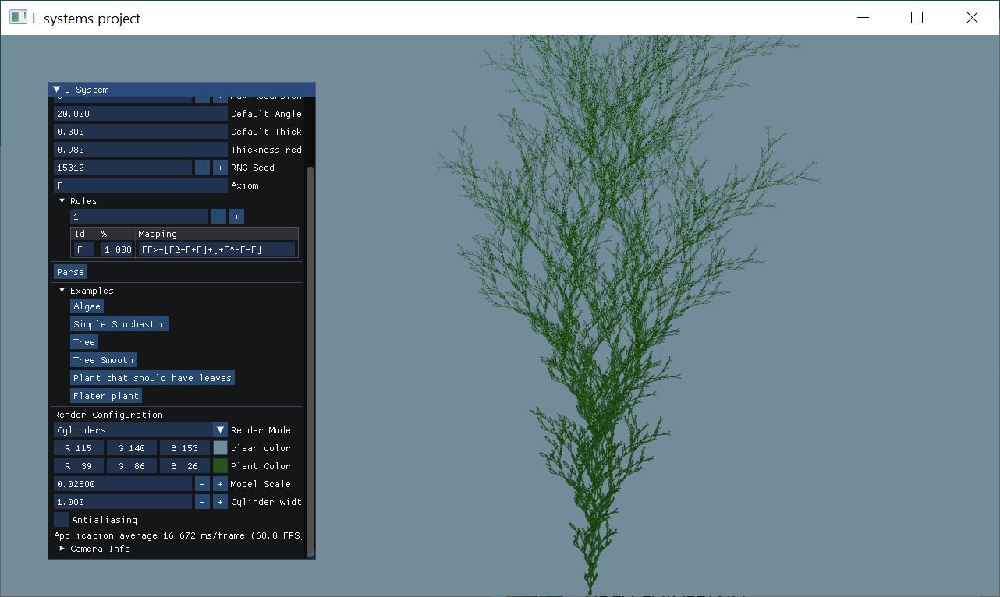
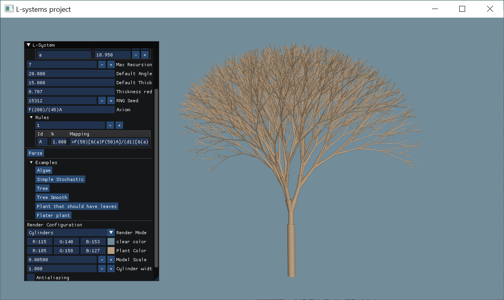
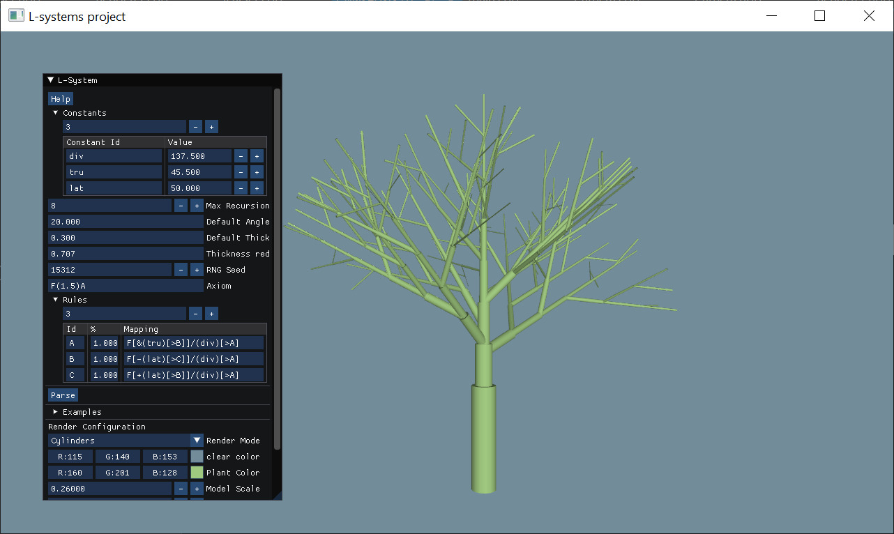

# L-systems
By Pol Martín Garcia

## Compilation
This project can be compiled using the provided `CMakeLists.txt` file. 

All the libraries used by the project are also provided and will be compiled and linked as dependencies of the CMake project. These are:
* GLFW 3
* glad
* Dear ImGui
* glm
* OpenGL

Thus, the program can be compiled executed by running from the project directory:
```bash
mkdir build
cd build
cmake .. -DCMAKE_BUILD_TYPE=Release
make
./l-system
```

## Execution
This program provides a UI that lets the user configure the model that wants to generate. **For more information about the usage, look into the Help window**.

The system supports:
* Multiple 3D operators
* Multiple rules
* Default and specific parameters for the operators
* Setup of constants to be used as parameters
* Stochastic L-system

Also, the software accepts different options to inspect the resulting model, such as:
* Interactive scene (camera movement)
* Different rendering modes (lines, and cylinders)
* Custom background and model color
* Enable/Disable antialiasing x4
* Model scaling

There are multiple examples available to be loaded from the very same UI.



